# Hotel management web: marketplace, hotel microsites, sales pages

The customer-facing web app for a multi-tenant hotel management SaaS for Nigerian hotels, built by
Devstrike Digital Limited. One Next.js app serves three things:

- **The marketplace**: search independent hotels across Lagos, Abuja, Port Harcourt, Calabar, Ibadan and Enugu.
- **Per-hotel microsites**: each hotel's own booking site on `{slug}.APP_DOMAIN` or a verified custom domain,
  re-tinted with the hotel's brand colour.
- **For hotels and pricing**: the B2B sales page and the plan comparison.

The product name is not final. It is always read from `NEXT_PUBLIC_APP_NAME` and appears in the wordmark,
titles, metadata, OpenGraph cards and footers. Nothing in the code hard-codes it.

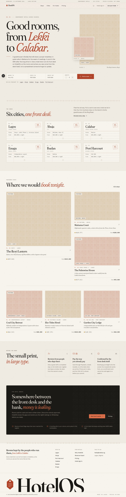

| Hotel page (dark) | Microsite, brand-tinted | The confirmation card |
|---|---|---|
| 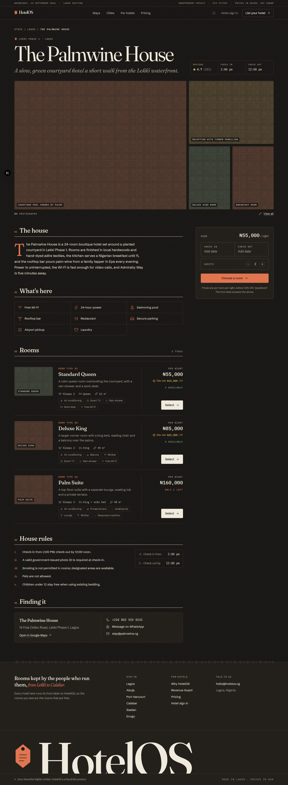 | 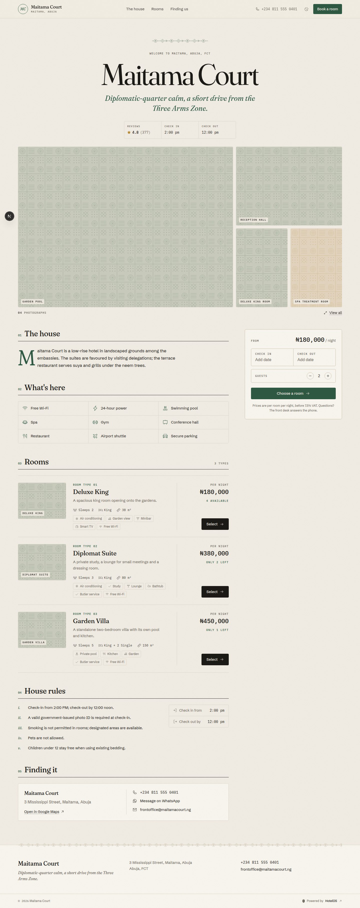 | 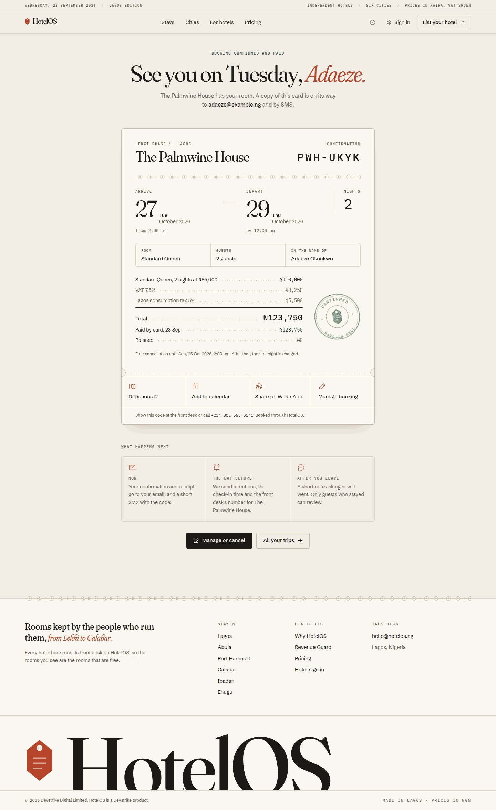 |

| For hotels | Pricing | Phone, 390px |
|---|---|---|
| 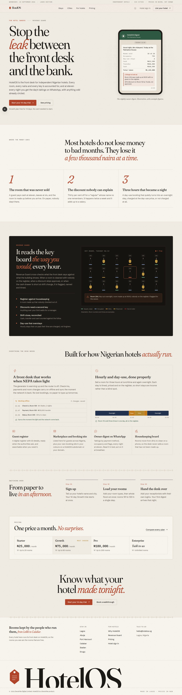 | 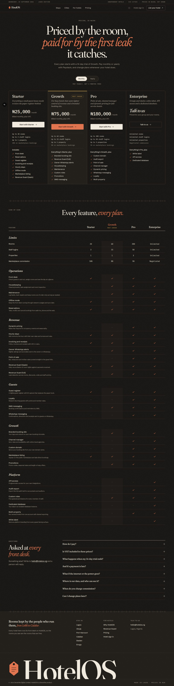 | 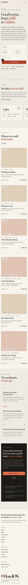 |

Every page is in [`docs/screenshots/`](docs/screenshots) at 1440px and 390px, light and dark, plus the
date range picker, city combobox, lightbox, booking validation and review, the empty state, the mobile menu,
the 404 and the OpenGraph cards.

> **About the photographs in the screenshots.** The sandbox these were taken in blocks `images.unsplash.com`,
> so every photo frame shows its designed fallback: a tinted adire "plate" with a caption. With network access
> the seed data's Unsplash photos load into the same frames, fading in over the pattern.

## Stack

- Next.js 16 (App Router, Turbopack), React 19, TypeScript
- Tailwind CSS v4, CSS-first tokens in `src/app/globals.css` (Tailwind's default palette is removed)
- `@phosphor-icons/react` for every icon; no emoji anywhere
- Fraunces (display), Schibsted Grotesk (UI) and IBM Plex Mono (numbers, money) through `next/font/google`
- Server components and `fetch` for everything a search engine should see; client components only for
  interaction (search controls, filters, gallery, booking flow)

## Getting started

```bash
pnpm install
cp .env.example .env.local   # then adjust
pnpm dev                     # http://localhost:3000
```

The backend (`hotel-management-backend`) must be running on `http://localhost:4000` with its seed data.
If it is down, pages still render: sections that depend on it show a quiet notice instead of failing.

| Script | What it does |
|---|---|
| `pnpm dev` | Development server on port 3000 |
| `pnpm build` | Production build (type-checks as part of the build) |
| `pnpm start` | Serve the production build |
| `pnpm lint` | ESLint (Next core web vitals and TypeScript rules) |
| `pnpm test:e2e` | Playwright end-to-end tests against the running app and backend (see Testing) |

## Environment

| Variable | Example | Used for |
|---|---|---|
| `API_URL` | `http://localhost:4000` | Server-side API calls (no `/api/v1`; the client adds it) |
| `NEXT_PUBLIC_API_URL` | `http://localhost:4000` | Fallback for `API_URL`; available to the browser |
| `NEXT_PUBLIC_APP_NAME` | `HotelOS` | Product name everywhere: wordmark, titles, OG cards, footers |
| `NEXT_PUBLIC_APP_DOMAIN` | `hotelos.ng` | Root domain; hotel subdomains hang off it |
| `NEXT_PUBLIC_SUPPORT_EMAIL` | `hello@hotelos.ng` | Contact links, Enterprise "Talk to us" |
| `NEXT_PUBLIC_SITE_URL` | `http://localhost:3000` | Canonical URLs, sitemap, `metadataBase` |
| `NEXT_PUBLIC_ADMIN_URL` | `http://localhost:3001` | Hotel sign-in and signup CTAs (`/signup?plan=<code>`) |
| `MARKETPLACE_HOSTS` | `staging.example.com` | Optional. Extra hosts that should serve the marketplace |
| `TRUSTED_PROXY_SECRET` | a long random string | Server-only. Sent as `X-Proxy-Auth` with the visitor's `X-Client-IP`; must equal the backend's value (see "Trusted client address") |
| `CLIENT_IP_HEADER` | `cf-connecting-ip` | Optional. A header your host sets with the visitor's address that clients cannot forge |
| `NEXT_PUBLIC_PARTNER_API_URL` | `https://api.hotelos.ng/api/partner/v1` | Optional (M6). The partner API base the developer docs show; defaults to `NEXT_PUBLIC_API_URL` + `/api/partner/v1` |
| `ALLOWED_DEV_ORIGINS` | `harmattanhotels.com,**.harmattanhotels.com` | Development only (M6). Custom domains pointed at your machine that may load dev assets; defaults to the white-label demo |

`NEXT_PUBLIC_*` values are inlined at build time, so rebuild after changing them.

## Multi-tenant routing

Routing is done in `src/proxy.ts` (Next 16 renamed middleware to proxy; it runs on Node.js). It looks at the
`Host` (or `X-Forwarded-Host`) header:

| Host | Result |
|---|---|
| `APP_DOMAIN`, `www.APP_DOMAIN`, `localhost`, an IP, or a `MARKETPLACE_HOSTS` entry | The marketplace, unchanged |
| `{slug}.APP_DOMAIN` | That hotel's microsite |
| `{slug}.localhost` | That hotel's microsite (local development; browsers resolve `*.localhost` to 127.0.0.1) |
| Any other host | Looked up with `GET /public/resolve-host?host=...`; a verified custom domain gets its hotel, anything else a 404 |
| `{group}.APP_DOMAIN` of a hotel group (M5, `kind: GROUP`) | The group's root: `/` lists its hotels, `/{property slug}/...` is that hotel's microsite, other paths redirect to the first hotel |
| `/h/{slug}/...` on a marketplace host | Path fallback to the microsite, so it works on plain `localhost:3000` |
| `/developers/...` on any hotel host (subdomain, custom domain, group) | 404: the developer docs belong to the marketplace host only (M6) |
| `/g/{group}/...` on a marketplace host | Path fallback to a group's root (M5) |

Hotel hosts are rewritten internally to `/h/{slug}{path}` (group roots to `/g/{group}{path}`). The proxy also sets an
`x-site-base` request header: empty on a hotel's own host, `/h/{slug}` on the path fallback, `/{slug}` for a hotel shown
under its group's host (with `x-site-group` saying where the group's root is). The microsite builds all of its links from it,
so the same pages work under both schemes. Incoming `x-site-base` headers are always stripped on marketplace
routes, so a client cannot spoof it. On a custom domain (M6) the proxy also sets `x-site-host`, which the microsite passes to
`GET /public/hotels/:slug?host=` so the API can answer with a white-labelled hotel's brand; client copies of every `x-site-*`
header are dropped.

Subdomains are resolved through the API as `{slug}.APP_DOMAIN`, so the backend stays the authority on which
hotels exist. Results are cached in memory per host for 5 minutes (misses for 1 minute). If the API is
unreachable, a subdomain falls back to its own label as the slug, and the page 404s if that is wrong.

Try it locally:

```bash
open http://localhost:3000/h/maitama-court                          # path fallback
open http://maitama-court.localhost:3000                            # subdomain, like production
curl -H "Host: maitama-court.hotelos.ng" http://localhost:3000/     # as the real domain
```

Each microsite has its own `robots.txt`, `sitemap.xml` and OpenGraph card in its brand colour.

## Pages

| Route | What it is |
|---|---|
| `/` | Editorial hero, search ledger, cities as library index cards, featured stays, trust section |
| `/stays?city=&checkIn=&checkOut=&guests=&min=&max=&amenities=&sort=` | Results with price and amenity filters, sort, skeleton, empty state |
| `/stays/[slug]` | Hotel page: gallery and lightbox, description, amenities, rooms, house rules, location, stay card |
| `/stays/[slug]/book` | Booking flow (channel `MARKETPLACE`) |
| `/booking/confirmation` | Paystack return and pay-at-hotel landing: verifies, then the confirmation card |
| `/h/[slug]`, `/h/[slug]/book`, `/h/[slug]/booking/confirmation` | The same pages as a branded microsite (channel `BOOKING_SITE`) |
| `/g/[group]` | A hotel group's root: its hotels, each leading to its own microsite (M5) |
| `/account/sign-in`, `/account/verify`, `/account`, `/account/points` | Phone sign-in, emailed sign-in link, profile, loyalty points per hotel group (M5) |
| `/trips`, `/trips/[code]?t=` | Upcoming and past stays; one booking with cancel, documents, review |
| `/trips/[code]/documents/[kind]/[id]?t=` | Printable invoice or receipt |
| `/review?t=` | Review a checked-out stay |
| `/pay/mock`, `/dev/mailbox`, `/dev/preview` | Development only (404 in production): practice checkout, outbox, component preview |
| `/for-hotels` | The sales page: revenue leakage, Revenue Guard, offline desk, day use, the owner digest |
| `/pricing` | Plans and features from the API, monthly or yearly, comparison table, FAQ |
| `/sitemap.xml`, `/robots.txt`, `opengraph-image` | SEO, with OG cards drawn in the brand fonts |
| `/developers`, `/developers/{guide}` | M6 developer docs: overview and nine guides (marketplace host only) |
| `/developers/reference`, `/developers/reference/[group]` | M6 API reference, rendered from the partner API's OpenAPI document |
| `/developers/openapi.json` | The spec the reference was built from, to import into Postman or a generator |
| `/h/[slug]/trips/[code]`, `/h/[slug]/review` | M6: manage a booking and review a stay on a white-labelled hotel's own domain |

## Design notes: "Laterite and Adire"

A Lagos boutique hotel's printed stationery crossed with a Swiss ledger, set like a printed travel magazine.

- **Colour.** Laterite earth for action, brass for "featured" and premium, palm, adire indigo and ochre for
  status. Every colour is a CSS variable with a light and a dark value; Tailwind's stock palette is switched
  off so nothing generic can creep in. A `night` utility gives always-dark bands their own local tokens.
- **Type.** Fraunces at optical size 144 with tight tracking for display, and its soft, "wonky" italic in
  laterite for the accent words. Schibsted Grotesk for reading. IBM Plex Mono with tabular figures for every
  number, date and naira amount (the grotesk has no naira sign; Plex does).
- **Editorial devices.** A dateline masthead, numbered plates with captions, a drop cap, roman-numeral lists,
  dotted leaders, numbered sections, catalogue index cards with a stamped count.
- **Adire.** Two thin-line motifs drawn for this project and used as CSS masks so they take any colour: a
  rule (ring, diamond, ticks) used as a section divider, and a patchwork field (rings, stripes, dots, crosses)
  used behind image frames and illustrations. Never clip art.
- **Illustration.** The brass key fob is the product mark. The 404 is a fob for Room 404, the empty state is a
  key board with every hook empty, and the For hotels page draws its product vignettes in HTML: the nightly
  owner digest on a phone, the Revenue Guard key board with a flagged room, the offline queue and a day-use
  timeline. All example figures are labelled as illustrations.
- **Microsite branding.** A hotel's `accentColor` replaces laterite inside its microsite. `src/lib/brand.ts`
  darkens it until it passes 4.5:1 on paper, derives a lighter variant for dark mode, and picks the text colour
  for buttons by contrast. The logo is used if set, otherwise an italic monogram.
- **Texture and shape.** A paper grain at a few percent, 1px hairlines instead of shadows, radii of 2 to 8px,
  shadows only on floating layers (popovers, the lightbox).
- **Motion.** Display lines rise out of their own baseline, sections fade up, photos fade in over their
  pattern, cards lift on hover, and the 404 fob swings. Everything is ease-out and collapses to nothing under
  `prefers-reduced-motion`.
- **Dark mode.** Follows the system; the toggle stores an explicit choice in `localStorage` (guarded with
  try/catch). An inline script sets the theme before first paint, and a CSS media query covers no-JS.

### Accessibility

Skip link, visible 2px laterite focus rings, semantic landmarks and headings, labelled controls, an ARIA 1.2
combobox for cities, a keyboard-operable grid calendar (arrows, Home/End, PageUp/PageDown), native `<dialog>`
for the menu and lightbox (Escape closes, arrow keys and swipe navigate), live regions for changing totals,
alt text on every photo and a labelled fallback when one fails to load, and AA colour contrast in both themes.

### Hydration note

Dates and naira are formatted by hand (`src/lib/dates.ts`, `src/lib/format.ts`) rather than with `Intl`, because
Node and browsers ship different ICU data ("Tue, 1 Sept" vs "Tue 1 Sep") and the difference breaks hydration.
Stay dates are plain ISO dates in Africa/Lagos.

## Project structure

```
src/
  proxy.ts                    host-based tenant routing
  app/
    layout.tsx, globals.css   fonts, theme script, design tokens and utilities
    (marketplace)/            home, stays, hotel page, booking and confirmation, account, trips, review, for-hotels, pricing
    api/v1/[...path]/         same-origin gateway to the backend (guest sessions in httpOnly cookies)
    pay/mock/, dev/           development-only checkout, mailbox and preview
    h/[slug]/                 hotel microsite (layout, page, book, robots, sitemap, og.png; M6 trips, documents, review)
    developers/               M6 developer docs: overview, guides, reference, openapi.json
    g/[group]/                hotel group root (layout, page, robots, sitemap, og.png)
    opengraph-image.tsx, sitemap.ts, robots.ts, not-found.tsx, error.tsx, icon.svg
  components/
    search/                   search bar, city combobox, range calendar, guests, filters
    hotel/                    cards, gallery and lightbox, hotel view, rooms, stay card, JSON-LD
    booking/                  booking flow, hold countdown, confirmation card, payment states
    account/                  sign-in and code input, trips, trip detail, cancel dialog, documents, points
    loyalty/                  members' card, tier chip, statement, redeem control, points to earn, join (M5)
    chat/                     "Chat with the hotel on WhatsApp" and the hook that finds a hotel's number (M5)
    reviews/                  guest book, review items, star input, review form
    dev/                      dev mailbox and component preview
    pricing/                  tiers and comparison table
    marketing/                city index cards, illustrations, product vignettes
    ui/                       wordmark, photo plate, money, amenity icons, theme toggle
    developers/               M6 docs shell, search, code plates and tabs, schema tree, operation, guide frame
    site/                     M6 white-label: brand fonts, footer links, platform credit, the site-links context
  lib/
    api.ts, types.ts          typed, server-only client for the public API
    rates.ts                  M4 view models: rate plans, price calendar, promo refusals, adapters from the API
    loyalty.ts                M5 view models: memberships, statement, the redemption offer
    server/client-ip.ts       the visitor's address and the trusted-proxy headers
    booking-types.ts          M3 contract types
    client-api.ts             browser client: timeouts, retries, idempotency keys, guarded sessionStorage
    server/bff.ts             the gateway: route allow-list, cookie sessions, single-flight refresh
    time.ts, ics.ts           Lagos instants, calendar files
    env.ts                    identity and URLs from the environment
    dates.ts, format.ts       Lagos dates, naira, VAT
    brand.ts                  hotel accent re-tinting with contrast checks
    white-label.ts            M6: a hotel's colours and fonts as tokens, safe font URLs and footer links
    developers/               M6: OpenAPI model, example and sample generation, highlighter, guides, search index
    site.ts                   microsite base path and origin
    og.tsx, og-hotel.tsx      OpenGraph image helpers (static TTFs in src/assets/og)
```

## API integration

`src/lib/api.ts` is a typed, server-only client for the public endpoints. Responses are cached in the Next data
cache (hotels 60s; cities, plans and features 5 minutes) with tags for later on-demand revalidation. Errors use
the backend envelope (`{ statusCode, code, message, details }`) as `ApiError`; `settle()` lets a page degrade
instead of crash.

Differences from the original contract, found against the live backend:

- `GET /public/hotels` caps `pageSize` at 48 (400 `VALIDATION_ERROR` above that), so `allHotels()` pages at 48.
- Everything else matched, including `resolve-host`, and `GET /public/hotels/:slug` returning unlisted hotels
  (for microsites) and 404 for suspended ones.

## Milestone 3: booking goes live

Real online booking on the marketplace and on every microsite, Paystack payments (card, bank transfer, USSD),
pay at the hotel, guest accounts, trips, cancellation with refunds, and verified-stay reviews. The contract is
the backend's `API-M3.md`.

| Review with the authoritative quote | The room held, calmly | The printed confirmation card |
|---|---|---|
| 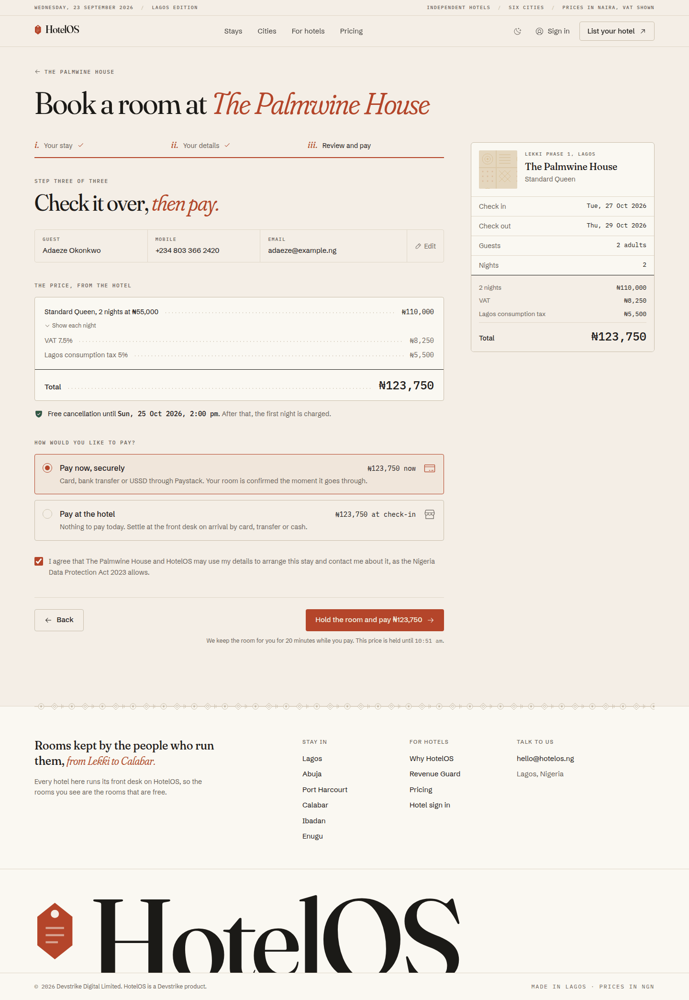 | 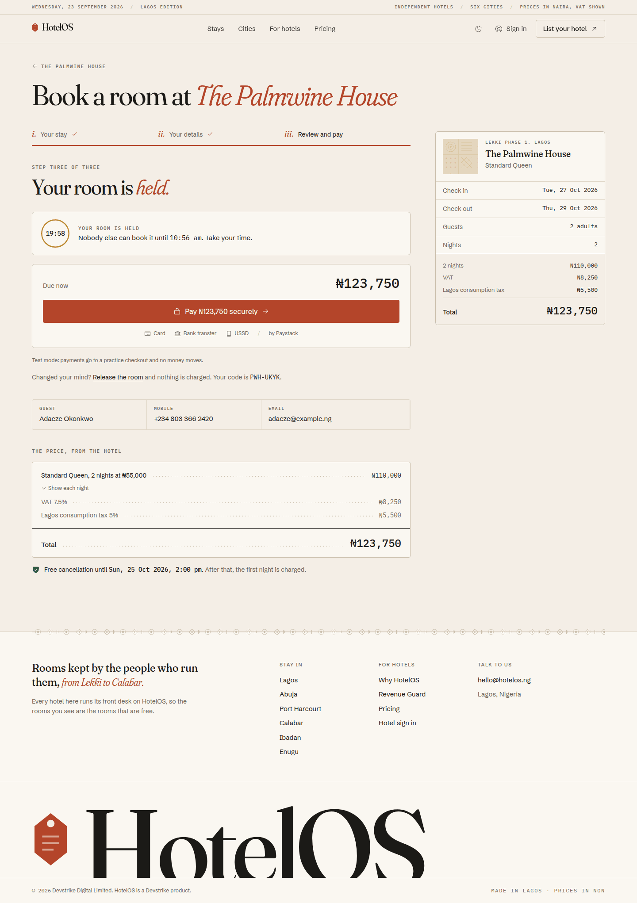 | 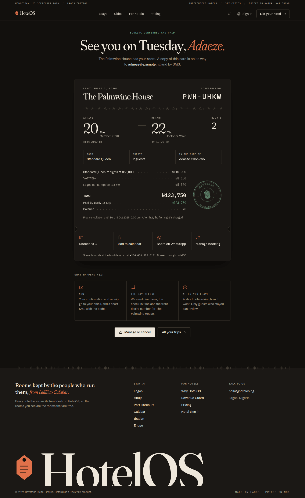 |

| Trips (phone, dark) | Cancel with the refund worked out | Review a stay | Microsite, in the hotel's colour |
|---|---|---|---|
| 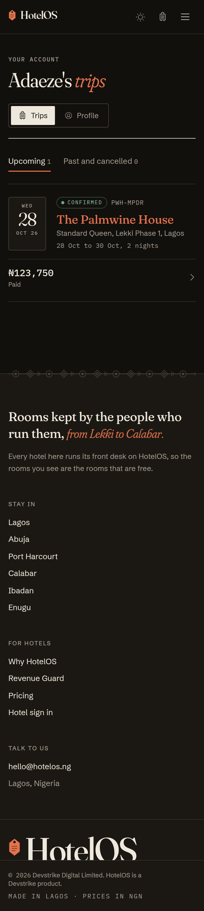 | 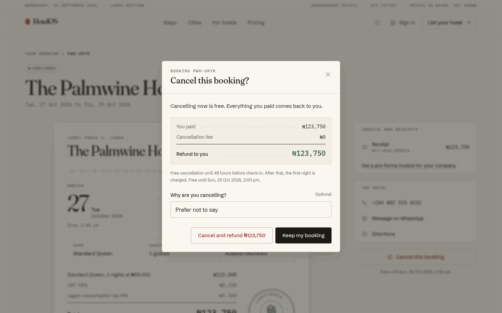 | 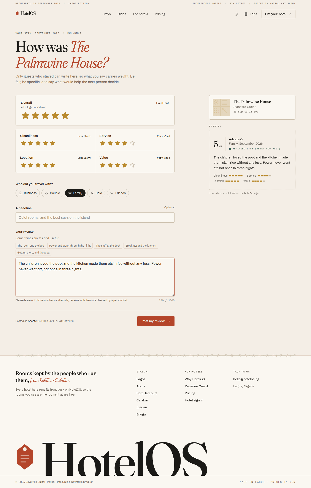 | 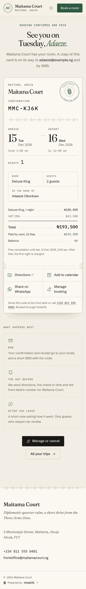 |

All M3 screens are in [`docs/screenshots/`](docs/screenshots) as `m3-*.png` (the core ones at 1440 and 390, light
and dark). They were taken against the live backend and its seed data, with the paper grain switched off so the
PNGs stay small; photo frames show their designed fallback because the sandbox blocks the image CDN.

### Search and hotel pages

- **Search with dates** sends `checkIn`, `checkOut` and `guests` to `GET /public/hotels`, which returns only hotels
  with a room free for every night. Each result shows the whole stay's price with taxes, how many room types are
  free and the hotel's free-cancellation window. A dated search with no results says so and offers the search
  without dates.
- **The hotel page** prices every room type live from `GET /public/hotels/:slug/availability` as the dates or
  guests change (debounced, cancellable, the last answer kept on screen while the next loads): the stay's
  total, the nightly rate before tax, "Only 2 left", or why a type cannot be booked. The side card and the
  phone's pinned bar carry the cheapest total and the free-cancellation deadline.
- **Cancellation terms** are set out as a three-step timeline (free, late, no-show) from the property's policy.
- **The guest book**: the aggregate score with subscore bars and a score distribution, a traveller-type filter,
  sorting, "Verified stay" marks, hotel replies and paging. Only verified stays can write here, and the page says so.

### The booking flow

Three steps, one page, on the marketplace (`MARKETPLACE` channel) and on microsites (`BOOKING_SITE`; a hotel
that is not listed on the marketplace is redirected to its own site to book):

1. **Your stay**: room type with live availability and totals, dates (or day-use hours where the hotel sells
   them), adults and children.
2. **Your details**: name, Nigerian mobile and email, arrival time and requests. "Booked with us before?" opens
   phone sign-in inline; a signed-in guest is filled in automatically and the booking joins their trips.
3. **Review and pay**: the authoritative quote from `POST /public/quotes`, each tax line as the hotel configured
   it, the exact free-cancellation deadline, the payment options with what is due now and at the hotel, and
   the data-protection consent. The quote's own 15-minute validity is shown; an expired quote is refreshed
   silently, and if the price moved the guest sees the new one before anything is booked.

Paying online first **holds the room**: the step turns into a countdown panel (a hairline ring that empties
like a slow clock, the time the hold runs until in plain figures, ochre and a reassuring sentence in the last
three minutes, never red, never flashing) with one button to Paystack and a way to release the room. Pay at
the hotel confirms immediately. Errors are specific: a room taken during checkout sends the guest back to
step one with what is still free; Paystack being down says the room was not held and suggests paying at the hotel.

### Payment return

`/booking/confirmation?reference=` polls `GET /public/payments/:reference/verify` every 2.5 seconds for a minute,
then more slowly. It pauses while the phone is offline and says so; after 15 seconds it explains that
transfers and USSD can take a minute and asks the guest not to pay again. Each outcome has its own screen:
**success** (then the card), **failed** (the hold countdown and a retry, which starts a new Paystack attempt),
**expired** (nothing charged, check the room again) and **refunding** (paid after the hold lapsed and the room
had gone). Once confirmed, the address becomes `?code=&t=`, so a reload never depends on the payment reference.

### The confirmation card

Set like a hotel's printed card: the hotel as letterhead, the code in large mono, arrival and departure as big
figures with check-in and check-out times, the particulars, a ledger with dotted leaders (room, each tax, total,
paid and outstanding) and an inked rubber stamp ("Confirmed / Paid in full" in palm, "Pay at hotel" in brass)
pressed on after the card slides in. Below a perforation, the stub: directions (Google Maps from the address),
add to calendar (the API's `.ics`, or Google Calendar), share on WhatsApp (dates and directions, deliberately
without the manage link, which can cancel the booking) and manage booking.

### Accounts and trips

- **Phone sign-in**: the number and SMS or WhatsApp, then six boxes that auto-advance, go back on Backspace,
  move with the arrow keys, and take a pasted or SMS-autofilled code from any box (`autocomplete=one-time-code`).
  A wrong code shakes once, clears and says how many tries are left; a locked number is explained calmly. The
  resend link unlocks after the API's `resendAfterSec`. An emailed sign-in link is the fallback.
- **Trips**: upcoming and past stays as luggage-tag rows (date stub, hotel, code, status chip, amount, a live
  hold countdown, "Review your stay" after check-out).
- **A trip**: the confirmation card, the hold and a pay button while awaiting payment, cancellation (a dialog
  that shows what was paid, the fee and the refund before anything happens, with "Keep my booking" as the
  primary action), invoices and receipts as printable pages (and a pro-forma invoice on request), contact and
  directions, and the review invitation. Manage links from confirmations work without an account.
- **Profile**: name and email; the phone is the sign-in and cannot be changed here.

### Reviews

`/review?t=` (from the emailed link or the trip page) checks eligibility first and explains why a stay cannot
be reviewed (already reviewed, not checked out, window closed). The form has star rows for the overall score
and each subscore (a radio group, keyboard-operable, the score also said in words), traveller type, an
optional headline and the text with prompts and a counter. A live preview shows exactly how it will appear.
A review that looks like it contains contact details is accepted and the guest is told a person will check it.

### The API gateway and guest sessions

The browser never calls the backend directly. `src/app/api/v1/[...path]/route.ts` (with `src/lib/server/bff.ts`)
forwards only `public/*` and `guest/*` routes:

- It works on every host this app serves, so hotel subdomains and custom domains need no CORS entries.
- Guest tokens live in **httpOnly cookies**; the gateway adds the bearer header on guest routes, quotes and
  bookings, refreshes once on a 401 and rotates the cookies. Refreshes are single-flight and remembered for a
  minute, so parallel requests never present a rotated refresh token twice (which would revoke the login).
  A readable `guest_hint` cookie holds only the first name, for the header's "Trips" link.
- It tells the backend who the visitor is with `X-Client-IP` and `X-Proxy-Auth` (see "Trusted client address").
- `src/proxy.ts` serves `/api/*`, `/pay/mock` and `/dev/*` as is on hotel hosts.

### Built for patchy mobile data

- Every call has a timeout; reads retry with backoff; writes retry only with an `Idempotency-Key`, so a retried
  "book this room" or "cancel" cannot happen twice (the backend also dedupes bookings by quote and phone).
- Guest details and a live hold are kept in `sessionStorage` (guarded), so a reload or the round trip to
  Paystack loses nothing; coming back from Paystack re-checks the payment before sending the guest there again.
- An offline notice replaces silent failures; skeletons hold the layout while live prices load.
- Countdowns use the server's clock (from the `Date` header), so a phone with the wrong time still counts down
  from the real twenty minutes.

### Development tools

- `/pay/mock?reference=`: the stand-in for Paystack's checkout when the backend has no Paystack key. It shows
  the amount and booking, pays (runs the webhook's success path) or declines, and returns to the callback.
- `/dev/mailbox`: the backend's dev outbox, live. Email, SMS and WhatsApp, filters and search, sign-in codes
  picked out with a copy button, HTML emails in a sandboxed iframe (`sandbox=""`: no scripts, no forms).
- `/dev/preview`: the M3 building blocks (card, countdown states, code input, payment states, review item).

## Milestone 4: rates, seasons and promo codes

Prices now move with the calendar. The contract is the backend's `API-M4.md` (sections 0 and 5.2, 6).

| Rates on the hotel page | The price calendar, Detty December and a closed arrival day | Review: each night, the promo, the saving |
|---|---|---|
| 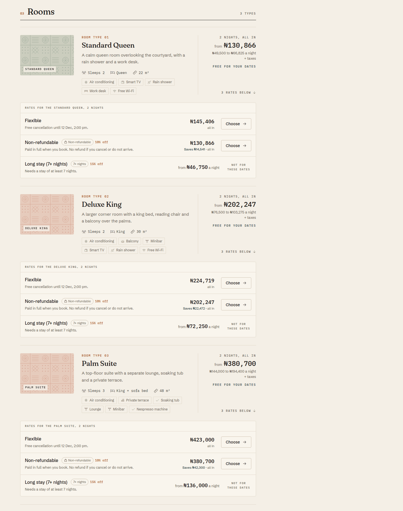 | 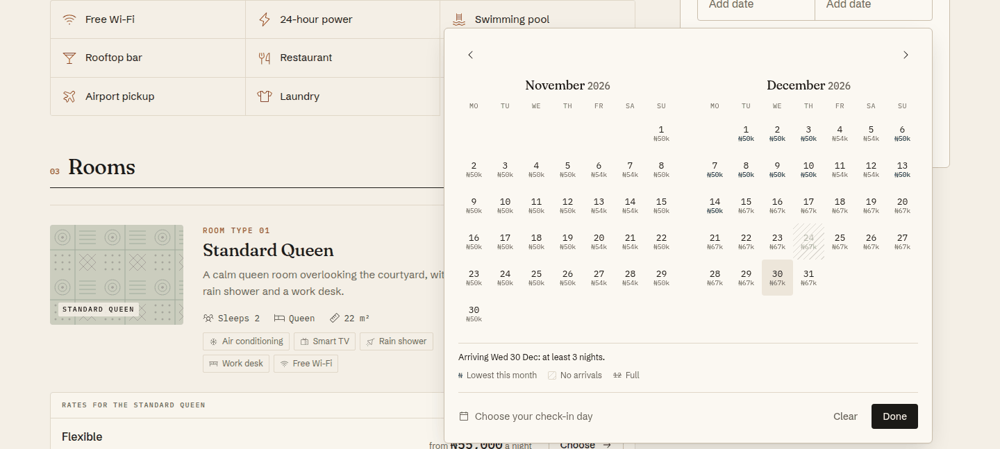 | 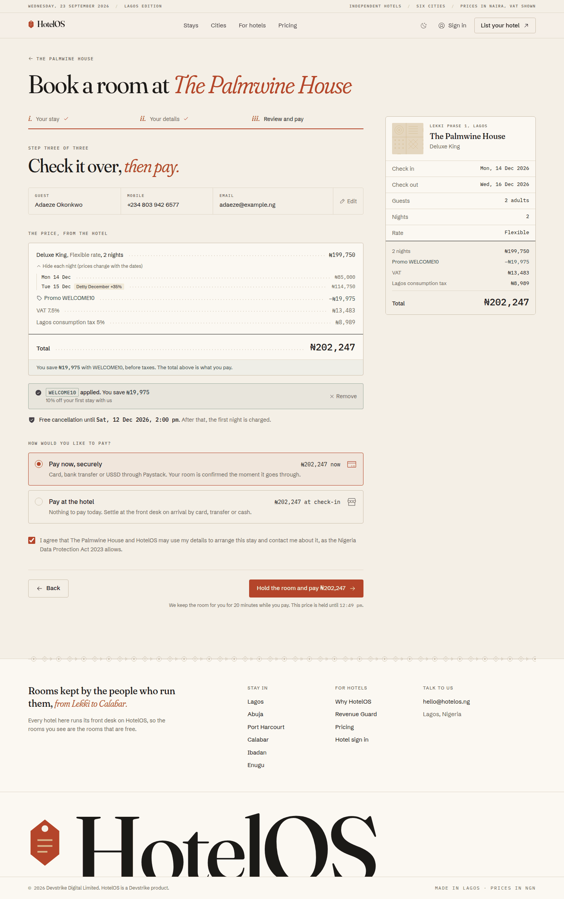 |

| Step one: seasons and rates (phone, dark) | A refused code, said plainly | Microsite rates (dark) |
|---|---|---|
| 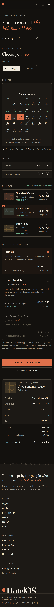 | 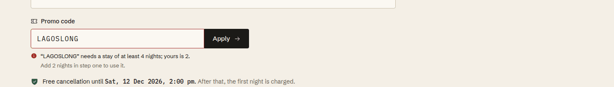 | 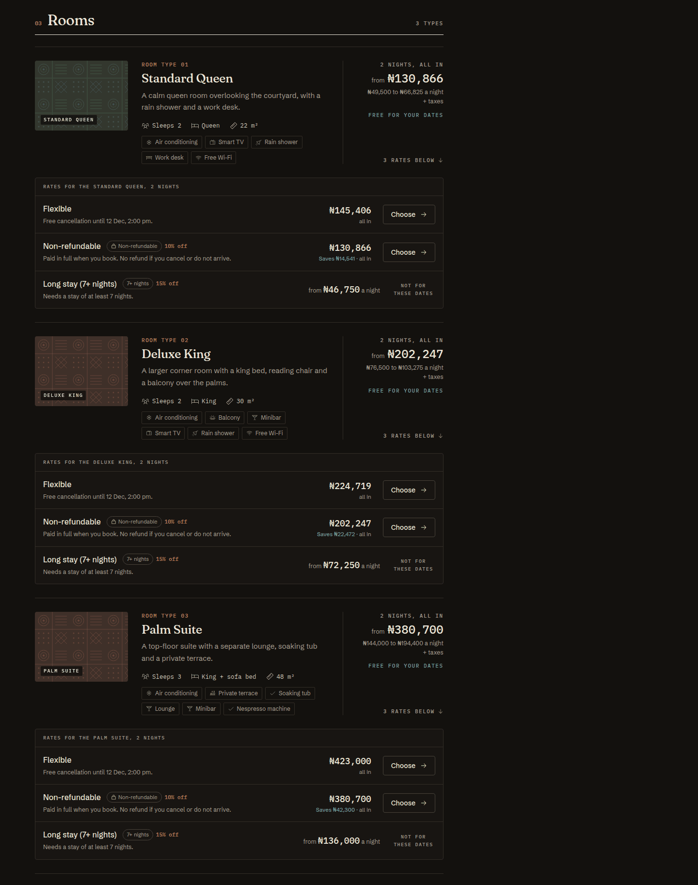 |

All M4 screens are in [`docs/screenshots/`](docs/screenshots) as `m4-*.png` at 1440 and 390, light and dark, taken
against the live backend and its M4 seed (Palmwine House, 14 to 16 December), grain off and quantised to 128 colours.
The M4 building blocks in every state (calendar ready, loading and offline; rate cards dated and undated; each promo
refusal) are on `/dev/preview?only=rates`.

### Rate plans

- **The hotel page** lists each room type's rates as a small ledger under the room when it sells more than one:
  "Flexible" (the hotel's Best Available Rate, renamed for guests) and "Non-refundable", each with its marks
  (free cancellation or non-refundable, breakfast included, "10% off"), the cancellation terms in one short
  sentence, the stay's total and what it saves against the flexible rate, and its own "Choose" link
  (`/book?room=&plan=`). The room's own price reads **"from"** the cheapest rate: without dates the lowest
  nightly price the hotel publishes for the next 60 days, with dates the cheapest stay across its rates.
- **Booking step one** adds the rate choice as two cards, with the difference said plainly: the flexible rate
  names the exact free-cancellation deadline; the non-refundable one says the whole stay is paid when booking
  and nothing is refunded. The chosen rate travels as `ratePlanId` into the quote (and so into the quote token).
- **Non-refundable** at review: a lock line in place of the free-cancellation line, and pay at the hotel is
  switched off (the quote's own payment options say why). The confirmation card names the rate and prints the
  non-refundable terms.
- Availability calls send the booking `channel` (marketplace or the hotel's own site), so the rates and prices
  shown are the ones the booking will charge.

### Nightly prices by date

- Every night is priced on its own (weekends, seasons such as Detty December, single-date overrides). When the
  nights differ, the review ledger opens to list each night with its date, its season as a brass tag and its
  price; the side summary and the room cards show a range ("₦85,000 to ₦114,750 a night").
- **The price calendar**: once a hotel is chosen (its page's date field and booking step one), each day in the
  picker carries the cheapest nightly price for the party, from `GET /public/hotels/:slug/price-calendar`.
  The month's lowest price is set in palm; **closed-to-arrival** days are hatched and cannot start a stay (you
  can still stay through them); full nights are struck through; closed-to-departure days cannot end a stay;
  the **minimum stay** for an arrival day is said under the grid while choosing and enforced on the check-out.
  Tapping a day that cannot be used says why instead of doing nothing. Screen readers hear the price, the season
  and any restriction in each day's label.
- It degrades quietly: skeleton bars while prices load (fetched per visible span, within the API's 62-day window,
  and kept for the page's life), a one-line notice if they fail (the dates still work and the room list prices
  them), a retry when the phone comes back online, and no prices at all against an API without the endpoint.

### Promo codes

- In the review step, behind a quiet "Have a promo code?". The code is checked by re-pricing the stay with it
  (`POST /public/quotes` with `promoCode`), so the saving shown is exactly what the quote token charges; a refused
  code leaves the price as it was.
- Applied: the code in a palm chip, "You save ₦26,350", a "Promo WELCOME10" line in the ledger and a saving line
  under the total, and a Remove link. The discount follows the booking onto the hold, Paystack and the card.
- Refused: one precise sentence per `PROMO_INVALID` reason and, where there is one, the way forward: expired
  (with the date), not valid for these dates (with the stay window), too few nights ("needs at least 4 nights;
  yours is 2. Add 2 nights in step one"), used up, already used by this number, first stay only, wrong room
  type, not sold here, or no saving on this rate. If a code stops working between the quote and the booking
  (the last use went), the guest is told, the stay is re-priced without it, and nothing is booked until they
  have seen the new total.
- Restrictions met at quote or booking time (`STAY_RESTRICTED`, `RATE_PLAN_UNAVAILABLE`) send the guest back to
  step one with the reason in words ("The hotel takes no arrivals on Thu 24 Dec").

### Trusted client address

The backend limits public routes per IP. Every call this app makes to the backend comes from its own server,
so the server says who the visitor is (`src/lib/server/client-ip.ts`):

- `X-Client-IP`: the visitor's address, and `X-Proxy-Auth`: `TRUSTED_PROXY_SECRET`. The backend believes the
  first only when the second matches (constant-time compare); anyone else's `X-Client-IP` is ignored.
- Which address: the header named by `CLIENT_IP_HEADER` if your host sets one clients cannot forge
  (`cf-connecting-ip`, `x-vercel-forwarded-for`); otherwise the **last** `X-Forwarded-For` hop, the one your own
  edge proxy appended (earlier hops are whatever the client claimed); otherwise `X-Real-IP`. Ports, brackets and
  IPv4-mapped IPv6 are normalised and anything that is not an address is dropped.
- Sent by the `/api/v1` gateway (every browser call, and the refresh and sign-out calls it makes), by uncached
  server-side fetches, and by the host proxy's `resolve-host` lookup. Cached server fetches are shared by every
  visitor (and Next keys its data cache on request headers), so they carry the credential without an address.
- The secret is a server-only variable (never `NEXT_PUBLIC_`), so it is not inlined into any browser bundle; a
  Playwright test fetches every script a page loads and checks. Client copies of both headers are stripped by
  `src/proxy.ts` and never copied by the gateway. Without a secret nothing is sent.

### Tests (M4)

| Spec | What it proves |
|---|---|
| `rates.spec.ts` | Book with a promo code: an expired code is refused precisely and leaves the price alone; WELCOME10 shows its saving, and the discounted total is what the hold, the checkout and the card charge. Book the non-refundable rate on the microsite: the hotel page states both rates' terms and the saving, the card prints non-refundable terms. The review step's non-refundable line and disabled pay-at-hotel. A stay into Detty December: the price calendar shows prices, and the ledger lists each night with its season and the right amounts |
| `trusted-ip.spec.ts` | Which address is believed (last hop, platform header, normalisation), that the gateway sends `X-Client-IP` and `X-Proxy-Auth` and drops a client's own copies, that nothing is sent without a secret, and that the secret is in no browser bundle |

## Milestone 5: hotel groups, loyalty and WhatsApp

The Pro tier on the guest side. The contract is the backend's `API-M5.md` (sections 1.9, 6.4 and 7).

| A group's own site | "Use N points" at review | Points per hotel group |
|---|---|---|
| 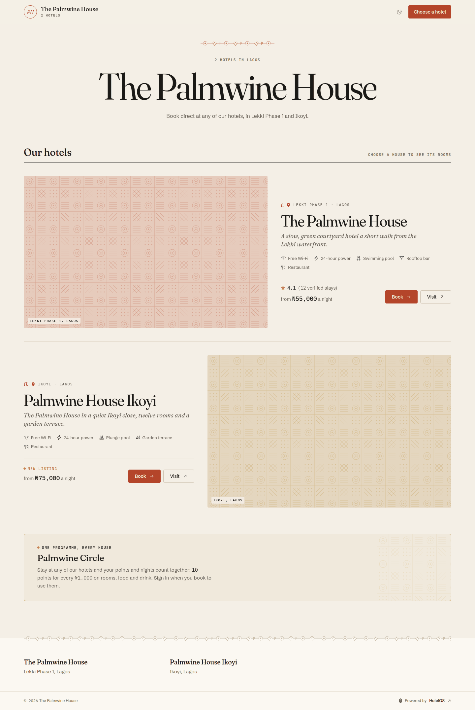 | 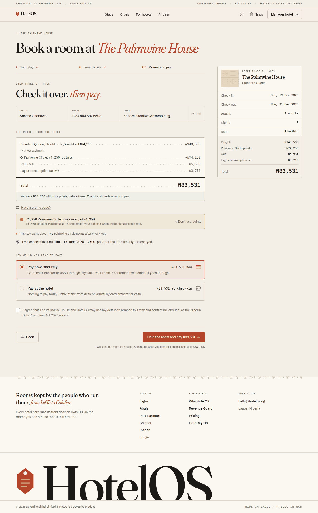 | 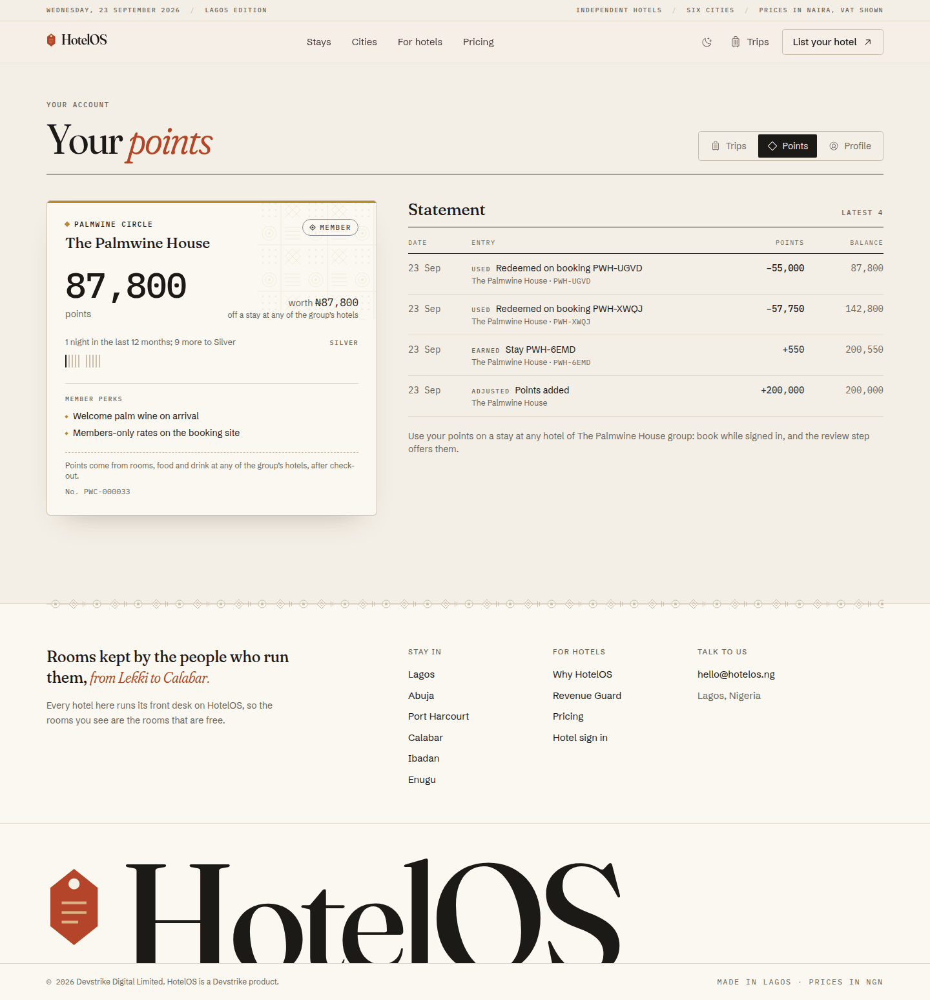 |

| Group site (phone, dark) | Confirmation: points to earn, WhatsApp | A trip after check-out (phone, dark) | Chat on a Pro hotel's page |
|---|---|---|---|
| 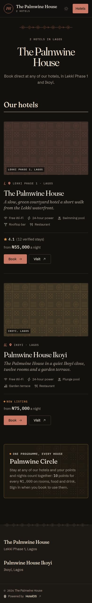 | 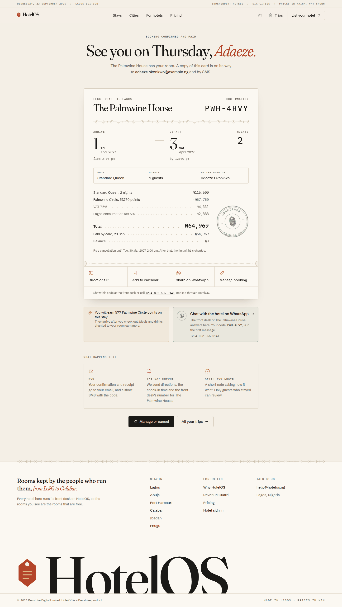 | 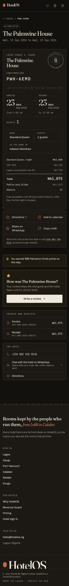 | 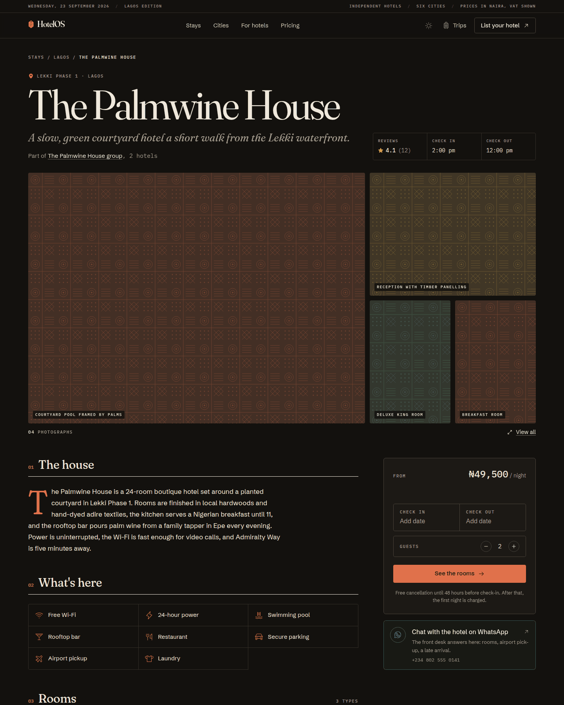 |

All M5 screens are in [`docs/screenshots/`](docs/screenshots) as `m5-*.png` at 1440 and 390, light and dark, taken against the
live backend and its M5 seed (the Palmwine House group with Lekki and Ikoyi, "Palmwine Circle"), grain off and quantised.
The building blocks in every state are on `/dev/preview?only=m5`.

### Hotel groups

- **The group's root.** `{group}.APP_DOMAIN` (the tenant's subdomain) of a group with two or more properties resolves as
  `kind: GROUP`. Its `/` is the group's register of hotels: the group as masthead, then each property as a numbered entry
  (plate, place, voice, rating, "from" price) with **Book** and **Visit**, and the group's loyalty programme if it has one.
  `/g/{group}` is the path fallback, like `/h/{slug}`.
- **Each hotel keeps its own microsite.** From the group root a hotel links to its canonical address when that is another
  host (its own subdomain or verified custom domain). Under the group's host, `/{property slug}/...` serves that hotel's
  microsite too (with `x-site-base: /{slug}`), which is what makes the primary property reachable when the group's host and
  its subdomain are the same name. Any other path on a group host (an older `/book` link, a Paystack return) is
  redirected to the first hotel with a 308, query intact. A group of one simply redirects to its hotel.
- A microsite of a group links back ("Our 2 hotels" in the header, "One of 2 hotels of ..." in the footer).
- **The marketplace** lists every property on its own; cards, result rows and the hotel page say "Part of The Palmwine House
  group, 2 hotels".
- The proxy caches each host's answer (property, or group with its property slugs from `GET /public/groups/:slug`) for five
  minutes. If the group lookup fails the host still serves its primary property.

### Canonical addresses and custom domains

`HotelDetail.canonicalUrl` (the verified custom domain, else `https://{slug}.APP_DOMAIN`) drives the microsite's
`<link rel=canonical>`, `og:url`, `metadataBase`, JSON-LD `url`, `sitemap.xml` and the `Sitemap:` line in `robots.txt`,
whichever host or path the page was reached on. Social cards are `/og.png` routes named on that host (the host proxy serves
them there); a group root's card lists its hotels. The group root's canonical is `https://{group}.APP_DOMAIN/`, and its
sitemap lists the root and every hotel at its canonical address.

### Loyalty

- **In the review step**, a signed-in member (the quote's `loyalty.member`) sees their balance with the group and
  **"Use 3,000 points (₦3,000)"**, the most the stay allows; "Use fewer" opens a slider in steps of 100 from the programme's
  minimum. Points are applied by re-pricing through `POST /public/quotes` with `redeemPoints` (alongside any promo code),
  so the ledger's "Palmwine Circle, 3,000 points" line, the total, the hold, Paystack and the card all agree. Refusals
  (`LOYALTY_REDEMPTION_LIMIT`, `LOYALTY_INSUFFICIENT_POINTS`, `LOYALTY_NOT_MEMBER`) are said plainly and leave the price as
  it was; if points stop fitting between quote and booking, the stay is re-priced without them and nothing is booked until
  the guest has seen the new total. The review also says roughly what the stay will earn.
- **Confirmation and trip** show "You will earn N Palmwine Circle points on this stay", and once the stay is checked out,
  "You earned N points"; the trips list marks past stays with "+N points".
- **`/account/points`** (a third account tab) shows one members' card per hotel group: programme and group as letterhead,
  the tier as a chip in the tier's own colour, the balance and what it is worth, the last twelve months' nights as tally
  marks struck through in fives up to the next tier, perks, points about to expire, and the member number; beside it the
  latest statement as a ledger (earned, used, expired, adjusted, reversed; points in palm, balance after each).
- **Joining**: a signed-in guest's trip page offers "Join Palmwine Circle" when the group lets guests enrol online
  (`POST /guest/loyalty/enrol`), and shows the balance for members.
- The gateway sends the guest's token on `public/hotels/:slug/loyalty` too, so it can say whether the guest is a member.

### WhatsApp chat

Hotels with `whatsapp_messaging` (`HotelDetail.whatsapp.available`) get **"Chat with the hotel on WhatsApp"**: a card under
the stay card and a line in "Finding it" on the hotel page, a card under the confirmation, and a line in the trip's hotel
panel. It is a plain `wa.me` link (the app on a phone, WhatsApp Web on a computer) with the first message ready:
"Hello The Palmwine House, this is about my booking PWH-7K3Q9." so the hotel's inbox ties the thread to the reservation.
Hotels without the feature no longer show a WhatsApp link at all, since nobody would be answering it.

### Tests (M5)

| Spec | What it proves |
|---|---|
| `m5.spec.ts` | The group root (`/g/palmwine-house`) lists both hotels in order; Ikoyi's entry opens its microsite and both hotels book on their own sites. The group's own host (`palmwine-house.localhost`) lists them and serves `/{slug}`, whose canonical link is the API's `canonicalUrl`. The marketplace shows each property "Part of" the group. A fresh member credited 3,000 points by the hotel (staff API) uses them at review: the ledger, the hold, the mock checkout and the card all carry the lower total, and the balance is 0 afterwards (API and `/account/points`). A member's stay tonight, checked in and out through the staff API, shows the points earned on the trip and in the trips list, and they reach the balance. WhatsApp chat shows on a Pro hotel and not on a Growth one, and the confirmation's and trip's links carry the booking code |

## Milestone 6: white-label and the developer docs

The Enterprise tier on the guest side. The contract is the backend's `API-M6.md` (sections 12, 13.4 and 14).

| The developer docs | An endpoint: schema, Python sample | Search, Ctrl/Cmd+K |
|---|---|---|
| 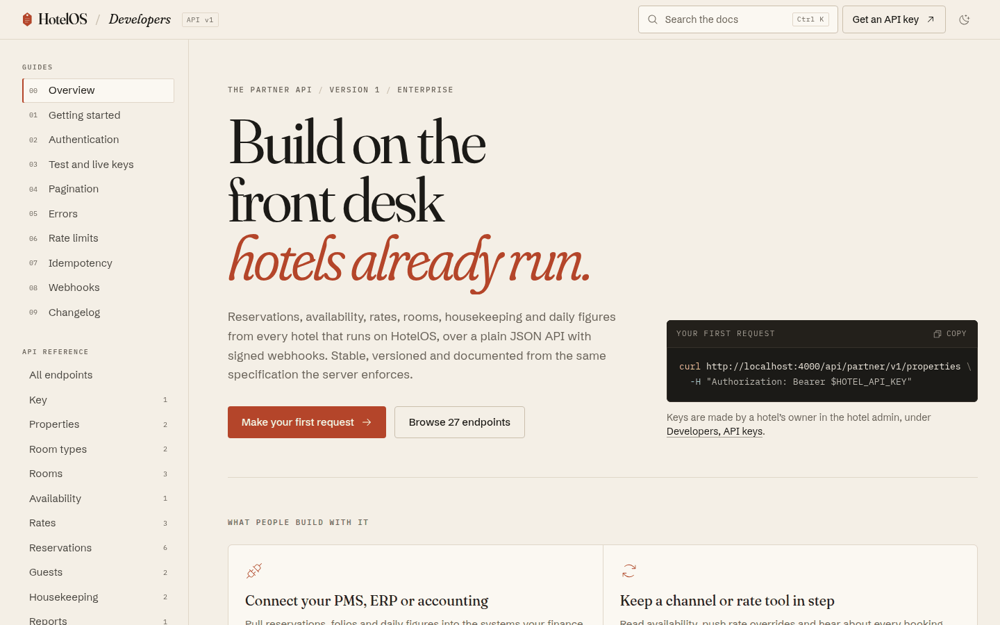 | 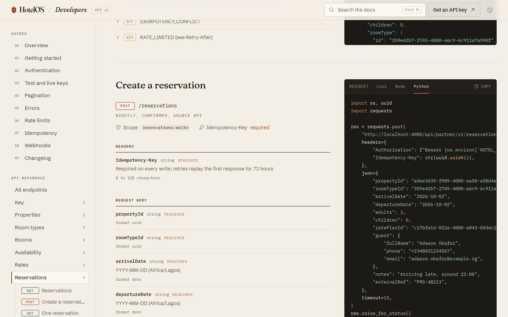 | 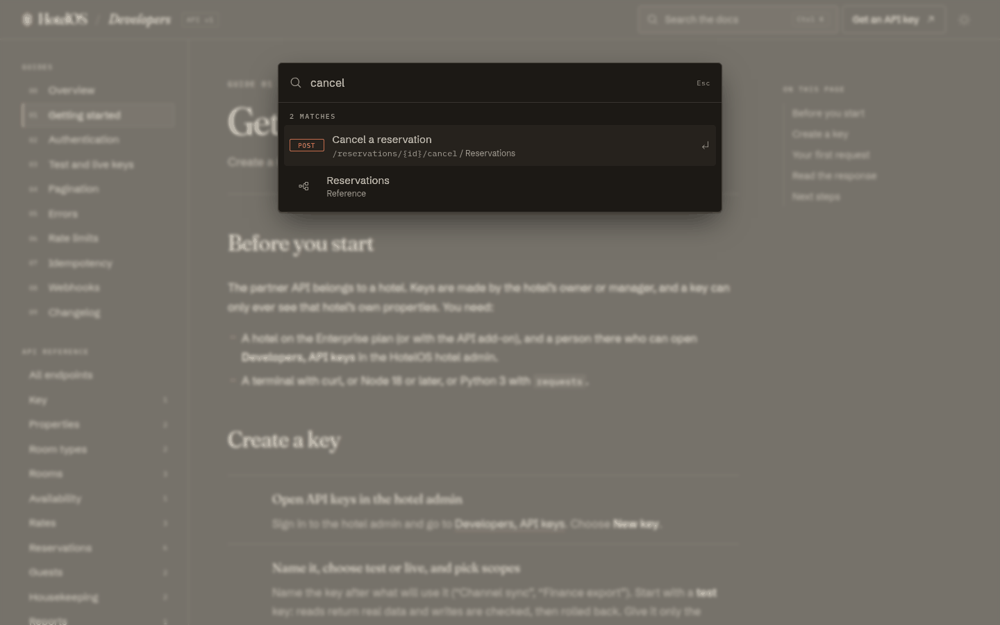 |

| White-label: Harmattan on its own domain | Its phone site (dark) | The confirmation, the hotel's initials on the stamp | Docs on a phone |
|---|---|---|---|
| 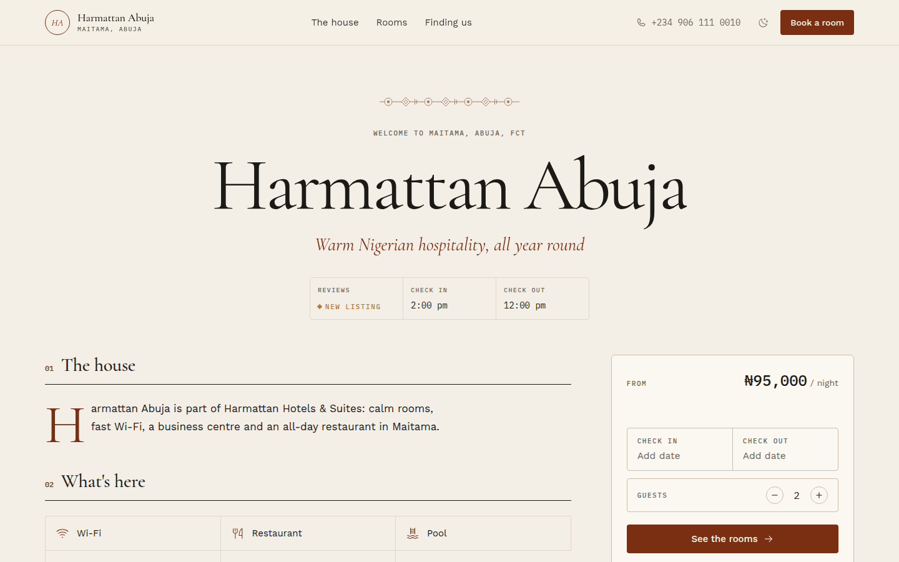 | 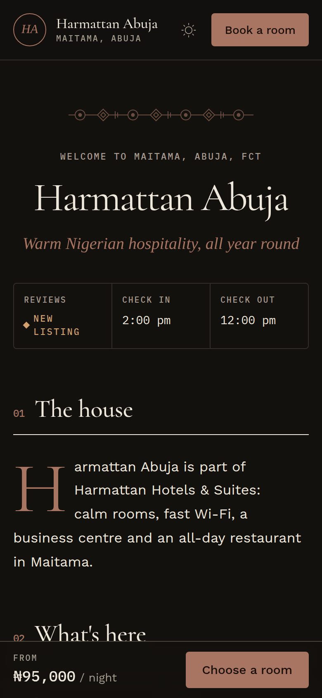 | 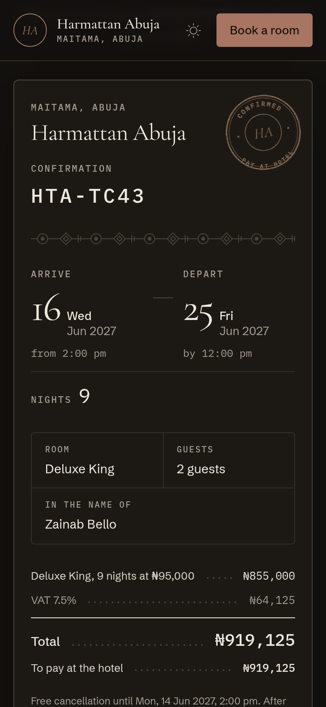 | 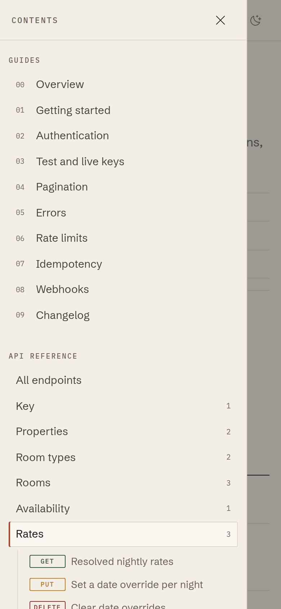 |

All M6 screens are in [`docs/screenshots/`](docs/screenshots) as `m6-*.png` at 1440 and 390, light and dark, taken against the live
backend (the partner spec and the Harmattan seed on `book.harmattanhotels.com`), grain off and quantised to 128 colours. The sandbox's
network to Google Fonts was unreliable: the white-label home shows the hotel's Cormorant Garamond and Work Sans, while the
confirmation shots show the house fonts the hotel's fonts fall back to when they cannot be fetched (by design, see below).

### White-label booking sites

A white-labelled hotel (feature `white_label`) is served on its verified custom domain as if the platform were not there.

- **How it is recognised.** The host proxy resolves the domain as before; for a custom domain (not `{slug}.APP_DOMAIN`) it also
  passes the host on as `x-site-host`, and the microsite asks `GET /public/hotels/:slug?host=...`. The API returns `whiteLabel`
  only when white-label is active and the host is that property's verified domain, so the same hotel on the platform's subdomain,
  the path fallback or the marketplace keeps the normal chrome.
- **No platform chrome.** No "Powered by", no key fob, no marketplace or account links, no platform name in the booking consent
  ("the hotel and its booking provider"), on the confirmation card or on printed documents. The group root on the platform's
  subdomain is not linked either.
- **The hotel's own brand.** Logo, favicon (in place of the platform icon), brand name in the copyright line and social card, and up
  to eight footer links (http, https, mailto and tel only).
- **Colours, with contrast kept.** The primary colour takes the laterite role (buttons, links, italic accents) and is darkened in
  light mode, or lifted in dark mode, until it reaches 4.5:1 on paper; the accent colour takes the brass role at 3:1. Text on buttons
  is chosen by contrast. Paper and ink stay the house's, so body copy never loses legibility.
- **Fonts.** The curated Google font the hotel chose for headings takes the display role; its body font is used only if it is a
  text face (a display face as body copy is ignored and the house grotesk stays). Money, dates and codes stay in IBM Plex Mono so
  figures still line up. Font URLs are accepted only from `fonts.googleapis.com` (anything else is rebuilt from the family name), and
  family names are checked before they go into CSS. The server sends preconnect and preload hints and a small client component
  attaches the stylesheets after hydration: a blocked or slow Google Fonts request can never hold the page (a React-managed
  stylesheet would), and `display=swap` keeps text readable meanwhile.
- **The guest never leaves the domain.** Manage booking, invoices and receipts, and the review form are served on the hotel's own
  domain (`/trips/{code}?t=`, `/trips/{code}/documents/...`, `/review?t=`), by the same token links as the marketplace. Guest
  accounts stay on the marketplace, so "All your trips" and sign-in are not offered there.
- **Group roots** on a custom domain use the brand the API returns for their properties with that host.
- Emails, SMS sender IDs and the PDF print views are white-labelled by the backend.

### Developer docs

`/developers` is the partner API's documentation, on the marketplace host only (every hotel host answers 404).

- **Guides**: overview, getting started (create a key in the hotel admin, first request with curl), authentication and scopes (key
  anatomy, property and IP restrictions, rotation), test and live keys (dry runs), pagination (cursors, `updatedSince` sync), errors
  (the envelope and every code), rate limits (the `RateLimit-*` headers and backing off), idempotency, webhooks (how delivery works,
  the event catalogue with each event's object, the payload, signature verification in Node, PHP and Python, retries and
  auto-disable, replay and test pings) and the changelog.
- **The reference is rendered in-house from `/api/partner/v1/openapi.json`**, fetched at build time and again every five minutes
  (ISR); if the API cannot be reached the copy committed in `src/content/developers/` is used and the page says so. Endpoints are
  grouped by tag, each with its method stamp, path, scope, `Idempotency-Key` requirement, parameters, request body and responses as
  schema trees whose nested objects open on demand (`$ref`, `allOf`, `oneOf`, nullable and cycles handled), and example requests in
  curl, Node and Python generated from the spec, beside an example response. The event catalogue and changelog come from the spec's
  `webhooks` and `x-changelog`.
- **Reading aids**: an ink code plate with an in-house highlighter (no dependency), copy buttons, one language switch shared by every
  sample on the page and remembered in `localStorage` (guarded), arrow keys between languages, deep links to every endpoint and
  section, `Ctrl/Cmd+K` search over guides, sections and endpoints, a sticky sidebar and an on-page contents with scroll-spy, a
  full-height contents sheet on phones.

### Dedicated databases

Harmattan's data lives in its own database (`hotel_t_harmattan`); the marketplace reads the backend's public listing projection.
Nothing changed in the web app: marketplace search, the hotel page and booking work the same, and a test books a Harmattan hotel end
to end.

### Tests (M6)

| Spec | What it proves |
|---|---|
| `developers.spec.ts` | The reference lists exactly the live spec's operations and says it was rendered from it; an endpoint shows its path, scope, Idempotency-Key and a nested body that opens on demand; choosing Python switches every sample, copies to the clipboard, and is remembered across pages and reloads; arrow keys move between languages; `Ctrl+K` finds an endpoint and a guide section and lands on it; deep links; the webhook catalogue matches the spec, verification in three languages; `/developers` is 404 on a subdomain, the path fallback and the white-labelled domain |
| `white-label.spec.ts` | On `book.harmattanhotels.com` (resolved to this machine by the browser, so the request carries the real `Host`): no platform name, credit or marketplace link on the hotel page or the booking page, the accent is the hotel's colour after the contrast guard, headings and body use the hotel's fonts, its favicon replaces the platform's, its footer links and brand name; the same hotel on the platform subdomain keeps the normal chrome. Then a booking on the domain, the confirmation without "Booked through", and managing it, all on the same domain |
| `harmattan.spec.ts` | Harmattan (dedicated database) is found by marketplace search and booked end to end with the mock Paystack checkout |

## Testing

```bash
pnpm test:e2e            # needs the web app on :3000 (started if not running) and the backend on :4000
```

Playwright runs Chromium from `PLAYWRIGHT_CHROMIUM`, or the sandbox's preinstalled build under `/opt/pw-browsers`.
The suite runs against the real backend and its seed data, one test at a time:

| Spec | What it proves |
|---|---|
| `search.spec.ts` | Search with dates returns priced, available hotels; the dates carry into live room prices, the policy and the guest book |
| `booking.spec.ts` | Book online, hold, pay on the mock checkout, land on the confirmation card with paid and balance; pay-at-hotel booking; a microsite booking stays on the hotel's site |
| `account.spec.ts` | OTP sign-in (code read from the dev outbox and pasted) shows the earlier booking in Trips; a wrong code is refused and corrected by typing; cancelling a paid booking shows and issues the full refund |
| `review.spec.ts` | Books and pays tonight's stay, checks it in and out through the staff API, then reviews it from the link; a second visit says it was already reviewed |
| `rates.spec.ts` | M4: promo code booking (saving shown and charged), non-refundable rate (microsite and review step), a Detty December stay priced night by night (see the M4 section) |
| `trusted-ip.spec.ts` | M4: which visitor address is sent and how, the secret absent from browser bundles, and live per-visitor rate-limit buckets |
| `m5.spec.ts` | M5: the group root and booking each of its hotels, the group host, "Part of" on the marketplace, redeeming points at booking, points earned after check-out, WhatsApp chat only on Pro hotels (see the M5 section) |
| `developers.spec.ts`, `white-label.spec.ts`, `harmattan.spec.ts` | M6: the docs and reference, white-label on a custom domain, Harmattan on its dedicated database (see the M6 section) |

Each test uses a fresh phone number and client address, and stays spread over the coming months, so runs do
not collide over rooms or the per-phone and per-IP limits. Staff credentials for the review test default to the
seeded owner and can be changed with `E2E_STAFF_EMAIL` and `E2E_STAFF_PASSWORD`.

## Contract notes (M3)

- Everything used matched `API-M3.md`. `GET /public/hotels` with dates, availability, quotes, bookings, verify,
  retry, the mock confirm, trips (view, cancel preview, cancel, documents, pro-forma invoice), OTP and email
  sign-in, `guest/*`, review requests and submissions, and the dev outbox all behave as specified.
- If a hotel's aggregate has a count but no published review items, the guest book shows its empty state rather
  than an average with nothing behind it.
- The review test posts a real review, then hides it again through the platform moderation endpoint, so the demo
  guest book is left as seeded (platform credentials: `E2E_PLATFORM_EMAIL`, `E2E_PLATFORM_PASSWORD`).
- The API's `whatsappShareUrl` includes the manage link (which can cancel the booking); the card builds its own
  share text with dates and directions instead.

## Contract notes (M4)

- Rates, plans, the price calendar, promo codes and restrictions match `API-M4.md` section 5.2 and 6 against the live backend.
- `API-M4.md` suggests the **first** `X-Forwarded-For` hop as the visitor's address. The first hop is whatever the client
  wrote, so this app sends the **last** hop (the one our edge appended) or a configured platform header instead.
- A plan's `label` mixes the discount and other terms (`"-10%, Non-refundable"`, `"-15%, 7+ nights"`); the discount is
  read out of it and the other terms come from `refundable`, `includesBreakfast` and `minNights`.
- Before M4 reached the backend, availability refused `channel` with a `VALIDATION_ERROR`; the client drops the parameter
  once if that happens, so an older backend keeps working.
- The trusted headers only take effect once the backend's `.env` has the same `TRUSTED_PROXY_SECRET` (16 characters or
  more) as this app's.

## Contract notes (M5)

- Group roots, `canonicalUrl`, `whatsapp`, `group`, `/public/groups/:slug`, `resolve-host` (`kind`, `groupSlug`), the quote's
  `redeemPoints` and `loyalty` block, `BookingView.loyalty`, `TripSummary.pointsEarned`, `/guest/loyalty`, enrolment and
  `/public/hotels/:slug/loyalty` match `API-M5.md` against the live backend.
- The group's name is the tenant's name, which for the demo is the same as its first hotel ("The Palmwine House"). The web
  says "Part of The Palmwine House group" so it does not read as the hotel being part of itself.
- A group root is served on the tenant's subdomain, which is also the primary property's subdomain (`palmwine-house`). So
  that the primary property stays reachable there, hotels are served under the group host at `/{slug}`; the primary
  property's `canonicalUrl` still names that same host, so the group root links to it at `/palmwine-house`.
- The review step needs the programme's point value and minimum, which the quote does not carry; it reads them from
  `/public/hotels/:slug/loyalty` once the quote says the guest is a member. The quote's `maxRedeemablePoints` is taken as
  the cap (with the balance), and "use fewer" moves in steps of 100.
- The BRIEF asks for WhatsApp chat on the hotel page and trip detail; it is also on the confirmation. Only `whatsapp.available`
  hotels show it, so the earlier "Message on WhatsApp" link to the front-desk phone is gone for other hotels.
- The backend's own test run replaces the seeded custom domains (Lekki's `book.thepalmwinehouse.com` was gone and Ikoyi had a
  test domain at the time of the screenshots); the web simply follows `canonicalUrl`, whatever it is.

## Not done yet

- Paystack Inline (the popup, using `accessCode`) is not used; the flow redirects to the hosted checkout, which
  is sturdier on low-end phones and in in-app browsers.
- Amenity filtering is still done in this app, as `GET /public/hotels` does not take amenities.
