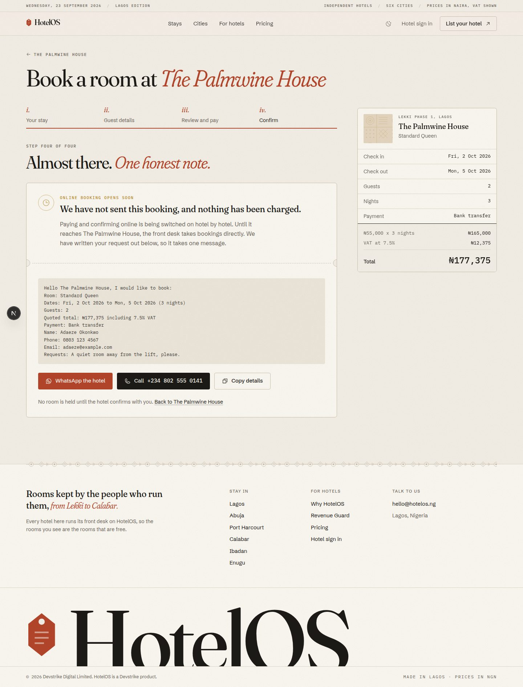

# Hotel management web: marketplace, hotel microsites, sales pages

The customer-facing web app for a multi-tenant hotel management SaaS for Nigerian hotels, built by
Devstrike Digital Limited. One Next.js app serves three things:

- **The marketplace**: search independent hotels across Lagos, Abuja, Port Harcourt, Calabar, Ibadan and Enugu.
- **Per-hotel microsites**: each hotel's own booking site on `{slug}.APP_DOMAIN` or a verified custom domain,
  re-tinted with the hotel's brand colour.
- **For hotels and pricing**: the B2B sales page and the plan comparison.

The product name is not final. It is always read from `NEXT_PUBLIC_APP_NAME` and appears in the wordmark,
titles, metadata, OpenGraph cards and footers. Nothing in the code hard-codes it.


| Hotel page (dark) | Microsite, brand-tinted | Booking, the honest last step |
|---|---|---|
|  |  |  |

| For hotels | Pricing | Phone, 390px |
|---|---|---|
|  |  |  |

Every page is in [`docs/screenshots/`](docs/screenshots) at 1440px and 390px, light and dark, plus the
date range picker, city combobox, lightbox, booking validation and review, the empty state, the mobile menu,
the 404 and the OpenGraph cards.

> **About the photographs in the screenshots.** The sandbox these were taken in blocks `images.unsplash.com`,
> so every photo frame shows its designed fallback: a tinted adire "plate" with a caption. With network access
> the seed data's Unsplash photos load into the same frames, fading in over the pattern.

## Stack

- Next.js 16 (App Router, Turbopack), React 19, TypeScript
- Tailwind CSS v4, CSS-first tokens in `src/app/globals.css` (Tailwind's default palette is removed)
- `@phosphor-icons/react` for every icon; no emoji anywhere
- Fraunces (display), Schibsted Grotesk (UI) and IBM Plex Mono (numbers, money) through `next/font/google`
- Server components and `fetch` for everything a search engine should see; client components only for
  interaction (search controls, filters, gallery, booking flow)

## Getting started

```bash
pnpm install
cp .env.example .env.local   # then adjust
pnpm dev                     # http://localhost:3000
```

The backend (`hotel-management-backend`) must be running on `http://localhost:4000` with its seed data.
If it is down, pages still render: sections that depend on it show a quiet notice instead of failing.

| Script | What it does |
|---|---|
| `pnpm dev` | Development server on port 3000 |
| `pnpm build` | Production build (type-checks as part of the build) |
| `pnpm start` | Serve the production build |
| `pnpm lint` | ESLint (Next core web vitals and TypeScript rules) |

## Environment

| Variable | Example | Used for |
|---|---|---|
| `API_URL` | `http://localhost:4000` | Server-side API calls (no `/api/v1`; the client adds it) |
| `NEXT_PUBLIC_API_URL` | `http://localhost:4000` | Fallback for `API_URL`; available to the browser |
| `NEXT_PUBLIC_APP_NAME` | `HotelOS` | Product name everywhere: wordmark, titles, OG cards, footers |
| `NEXT_PUBLIC_APP_DOMAIN` | `hotelos.ng` | Root domain; hotel subdomains hang off it |
| `NEXT_PUBLIC_SUPPORT_EMAIL` | `hello@hotelos.ng` | Contact links, Enterprise "Talk to us" |
| `NEXT_PUBLIC_SITE_URL` | `http://localhost:3000` | Canonical URLs, sitemap, `metadataBase` |
| `NEXT_PUBLIC_ADMIN_URL` | `http://localhost:3001` | Hotel sign-in and signup CTAs (`/signup?plan=<code>`) |
| `MARKETPLACE_HOSTS` | `staging.example.com` | Optional. Extra hosts that should serve the marketplace |

`NEXT_PUBLIC_*` values are inlined at build time, so rebuild after changing them.

## Multi-tenant routing

Routing is done in `src/proxy.ts` (Next 16 renamed middleware to proxy; it runs on Node.js). It looks at the
`Host` (or `X-Forwarded-Host`) header:

| Host | Result |
|---|---|
| `APP_DOMAIN`, `www.APP_DOMAIN`, `localhost`, an IP, or a `MARKETPLACE_HOSTS` entry | The marketplace, unchanged |
| `{slug}.APP_DOMAIN` | That hotel's microsite |
| `{slug}.localhost` | That hotel's microsite (local development; browsers resolve `*.localhost` to 127.0.0.1) |
| Any other host | Looked up with `GET /public/resolve-host?host=...`; a verified custom domain gets its hotel, anything else a 404 |
| `/h/{slug}/...` on a marketplace host | Path fallback to the microsite, so it works on plain `localhost:3000` |

Hotel hosts are rewritten internally to `/h/{slug}{path}`. The proxy also sets an `x-site-base` request header:
empty on a hotel's own host, `/h/{slug}` on the path fallback. The microsite builds all of its links from it,
so the same pages work under both schemes. Incoming `x-site-base` headers are always stripped on marketplace
routes, so a client cannot spoof it.

Subdomains are resolved through the API as `{slug}.APP_DOMAIN`, so the backend stays the authority on which
hotels exist. Results are cached in memory per host for 5 minutes (misses for 1 minute). If the API is
unreachable, a subdomain falls back to its own label as the slug, and the page 404s if that is wrong.

Try it locally:

```bash
open http://localhost:3000/h/maitama-court                          # path fallback
open http://maitama-court.localhost:3000                            # subdomain, like production
curl -H "Host: maitama-court.hotelos.ng" http://localhost:3000/     # as the real domain
```

Each microsite has its own `robots.txt`, `sitemap.xml` and OpenGraph card in its brand colour.

## Pages

| Route | What it is |
|---|---|
| `/` | Editorial hero, search ledger, cities as library index cards, featured stays, trust section |
| `/stays?city=&checkIn=&checkOut=&guests=&min=&max=&amenities=&sort=` | Results with price and amenity filters, sort, skeleton, empty state |
| `/stays/[slug]` | Hotel page: gallery and lightbox, description, amenities, rooms, house rules, location, stay card |
| `/stays/[slug]/book` | Booking flow |
| `/h/[slug]`, `/h/[slug]/book` | The same hotel page and flow as a branded microsite |
| `/for-hotels` | The sales page: revenue leakage, Revenue Guard, offline desk, day use, the owner digest |
| `/pricing` | Plans and features from the API, monthly or yearly, comparison table, FAQ |
| `/sitemap.xml`, `/robots.txt`, `opengraph-image` | SEO, with OG cards drawn in the brand fonts |

### The booking flow is honest on purpose

Reservations ship in a later milestone. The flow does everything up to that point: choose a room type and
either dates (a two-month range calendar) or day-use hours, enter guest details with Nigerian phone validation,
review a naira breakdown (nights times rate, 7.5% VAT, total) and choose Card via Paystack, bank transfer or
pay at the hotel. The last step then says plainly that online booking is not live for this hotel yet, that
nothing was sent or charged, and hands over the request prewritten for **WhatsApp** (`wa.me` with the text
filled in), a **phone call** (`tel:`) or the clipboard. It never shows a fake confirmation.

## Design notes: "Laterite and Adire"

A Lagos boutique hotel's printed stationery crossed with a Swiss ledger, set like a printed travel magazine.

- **Colour.** Laterite earth for action, brass for "featured" and premium, palm, adire indigo and ochre for
  status. Every colour is a CSS variable with a light and a dark value; Tailwind's stock palette is switched
  off so nothing generic can creep in. A `night` utility gives always-dark bands their own local tokens.
- **Type.** Fraunces at optical size 144 with tight tracking for display, and its soft, "wonky" italic in
  laterite for the accent words. Schibsted Grotesk for reading. IBM Plex Mono with tabular figures for every
  number, date and naira amount (the grotesk has no naira sign; Plex does).
- **Editorial devices.** A dateline masthead, numbered plates with captions, a drop cap, roman-numeral lists,
  dotted leaders, numbered sections, catalogue index cards with a stamped count.
- **Adire.** Two thin-line motifs drawn for this project and used as CSS masks so they take any colour: a
  rule (ring, diamond, ticks) used as a section divider, and a patchwork field (rings, stripes, dots, crosses)
  used behind image frames and illustrations. Never clip art.
- **Illustration.** The brass key fob is the product mark. The 404 is a fob for Room 404, the empty state is a
  key board with every hook empty, and the For hotels page draws its product vignettes in HTML: the nightly
  owner digest on a phone, the Revenue Guard key board with a flagged room, the offline queue and a day-use
  timeline. All example figures are labelled as illustrations.
- **Microsite branding.** A hotel's `accentColor` replaces laterite inside its microsite. `src/lib/brand.ts`
  darkens it until it passes 4.5:1 on paper, derives a lighter variant for dark mode, and picks the text colour
  for buttons by contrast. The logo is used if set, otherwise an italic monogram.
- **Texture and shape.** A paper grain at a few percent, 1px hairlines instead of shadows, radii of 2 to 8px,
  shadows only on floating layers (popovers, the lightbox).
- **Motion.** Display lines rise out of their own baseline, sections fade up, photos fade in over their
  pattern, cards lift on hover, and the 404 fob swings. Everything is ease-out and collapses to nothing under
  `prefers-reduced-motion`.
- **Dark mode.** Follows the system; the toggle stores an explicit choice in `localStorage` (guarded with
  try/catch). An inline script sets the theme before first paint, and a CSS media query covers no-JS.

### Accessibility

Skip link, visible 2px laterite focus rings, semantic landmarks and headings, labelled controls, an ARIA 1.2
combobox for cities, a keyboard-operable grid calendar (arrows, Home/End, PageUp/PageDown), native `<dialog>`
for the menu and lightbox (Escape closes, arrow keys and swipe navigate), live regions for changing totals,
alt text on every photo and a labelled fallback when one fails to load, and AA colour contrast in both themes.

### Hydration note

Dates and naira are formatted by hand (`src/lib/dates.ts`, `src/lib/format.ts`) rather than with `Intl`, because
Node and browsers ship different ICU data ("Tue, 1 Sept" vs "Tue 1 Sep") and the difference breaks hydration.
Stay dates are plain ISO dates in Africa/Lagos.

## Project structure

```
src/
  proxy.ts                    host-based tenant routing
  app/
    layout.tsx, globals.css   fonts, theme script, design tokens and utilities
    (marketplace)/            home, stays, hotel page, booking, for-hotels, pricing
    h/[slug]/                 hotel microsite (layout, page, book, robots, sitemap, OG)
    opengraph-image.tsx, sitemap.ts, robots.ts, not-found.tsx, error.tsx, icon.svg
  components/
    search/                   search bar, city combobox, range calendar, guests, filters
    hotel/                    cards, gallery and lightbox, hotel view, rooms, stay card, JSON-LD
    booking/                  the four-step booking flow
    pricing/                  tiers and comparison table
    marketing/                city index cards, illustrations, product vignettes
    ui/                       wordmark, photo plate, money, amenity icons, theme toggle
  lib/
    api.ts, types.ts          typed, server-only client for the public API
    env.ts                    identity and URLs from the environment
    dates.ts, format.ts       Lagos dates, naira, VAT
    brand.ts                  hotel accent re-tinting with contrast checks
    site.ts                   microsite base path and origin
    og.tsx, og-hotel.tsx      OpenGraph image helpers (static TTFs in src/assets/og)
```

## API integration

`src/lib/api.ts` is a typed, server-only client for the public endpoints. Responses are cached in the Next data
cache (hotels 60s; cities, plans and features 5 minutes) with tags for later on-demand revalidation. Errors use
the backend envelope (`{ statusCode, code, message, details }`) as `ApiError`; `settle()` lets a page degrade
instead of crash.

Differences from the original contract, found against the live backend:

- `GET /public/hotels` caps `pageSize` at 48 (400 `VALIDATION_ERROR` above that), so `allHotels()` pages at 48.
- Everything else matched, including `resolve-host`, and `GET /public/hotels/:slug` returning unlisted hotels
  (for microsites) and 404 for suspended ones.

## Not done yet

- Online reservations and payment (milestone 3); the flow stops honestly before sending anything.
- Reviews are shown as the API's `rating` and `reviewCount`; there is no review list yet.
- Amenity filtering and sorting happen in this app, because `GET /public/hotels` does not take those
  parameters yet. Price, city, guests and text search go to the API.
